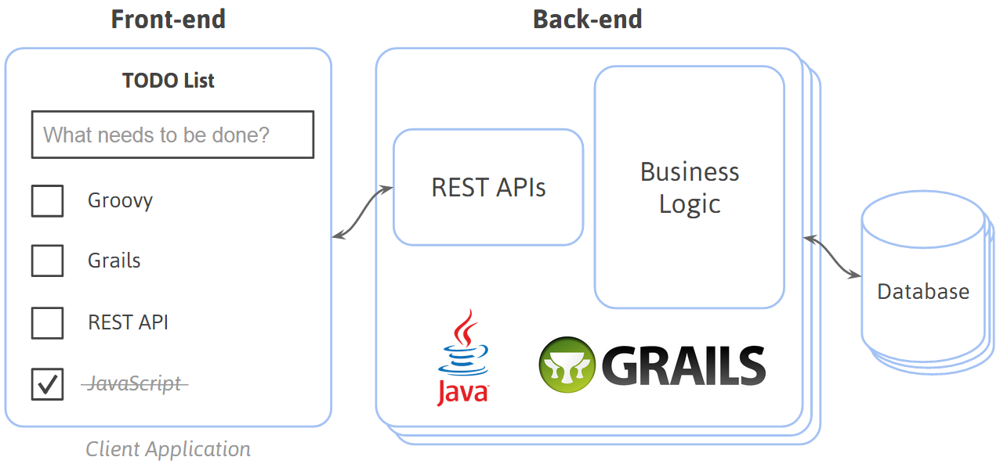

# Desenvolvimento de Web Services com Java {#desenvolvimento-de-web-services-com-grails}

O desenvolvimento de _web services_ com Java é bem simples considerando o uso da biblioteca Jersey. Em laboratório será desenvolvido um projeto de REST APIs para um aplicativo de lista de tarefas conforme a arquitetura a seguir.

Figura 2 – Arquitetura de web services com Grails

As apresentações a seguir são recomendadas para um estudo mais aprofundado sobre o tema:

* Link 1
* Link 2

