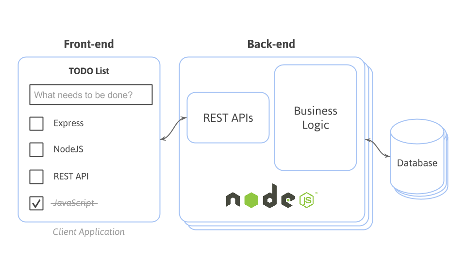

# Desenvolvimento de Web Services com PHP {#desenvolvimento-de-web-services-com-nodejs}

Para consolidar o conhecimento da linguagem PHP, em laboratório será desenvolvido um projeto de REST APIs para um aplicativo de lista de tarefas conforme a arquitetura a seguir.

As apresentações a seguir são recomendadas para um estudo mais aprofundado sobre o tema:

* Link 1
* Link 2

