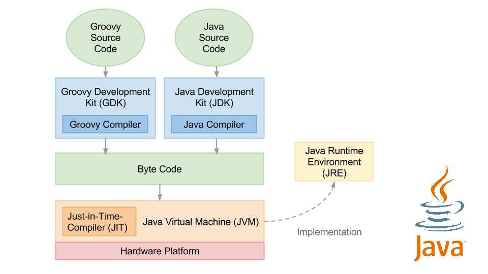

## Compilação e interpretação {#compila-o-e-interpreta-o}

Em relação a compilação e interpretação o Groovy é semelhante ao Java. Primeiramente é escrito um arquivo file.groovy, em seguida é gerado um bytecode que é interpretado pela máquina virtual, assim é possível estabelecer uma relação de igualdade com linguagem Java, onde o nível bytecode é equivalente entre as linguagens da JVM – Java Virtual Machine.

Figura 1 - Compilação e interpretação do Java e Groovy