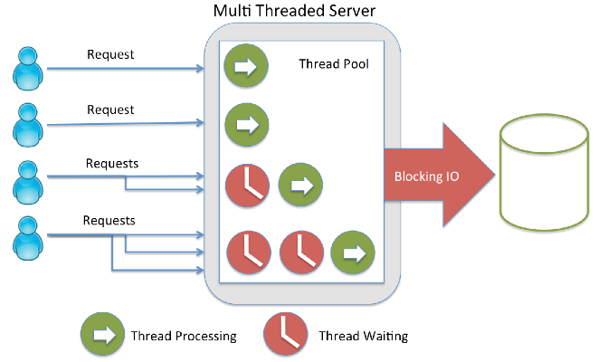

# Introdução ao framework NodeJS {#introdu-o-ao-framework-nodejs}

NodeJS é um ambiente de execução desenvolvido sob [_Chrome’s V8 JavaScript engine_](https://en.wikipedia.org/wiki/V8_(JavaScript_engine)) capaz de executar aplicações em JavaScript fora do browser. Com uma alta performance devido ao código JavaScript ser compilado para código de máquina, desde o seu surgimento em 2009, esta plataforma vem revolucionado o modelo de desenvolvimento de software que exijam uma alta escalabilidade e performance.

Diferente das linguagens tradicionais como Java, PHP, Python e Ruby, as quais bloqueiam a thread de execução para cada operação envolvendo I/O, NodeJS com o seu sistema de _Event Loop_ implementa o modelo de _threads_ não bloqueantes, utilizando uma única _thread_ para as requisições. A imagem a seguir demonstra este modelo comparado ao modelo tradicional.

Figura 3 - Event Loop do NodeJS

A plataforma NodeJS é mais indicada pra aplicações com uma alta intensidade na troca de dados entre cliente e servidor, tais como aplicações com informações em tempo real, games, ferramentas colaborativas, salas de bate-papo, sistemas de notificações, entre outras aplicações desse gênero.

Seguem alguns casos onde big players do mercado utilizam a plataforma NodeJS:

*   [Wallmart](http://venturebeat.com/2012/01/24/why-walmart-is-using-node-js/)
*   [Placar UOL](https://speakerdeck.com/fermads/placar-uol-copa-do-mundo-e-eleicoes-ao-vivo-com-node-dot-js-e-websockets)
*   [Netflix](http://www.talentbuddy.co/blog/building-with-node-js-at-netflix/)
*   [Microsoft](https://msdn.microsoft.com/en-us/magazine/jj991974.aspx)
*   [LinkedIn](http://venturebeat.com/2011/08/16/linkedin-node/)
*   [Google](http://venturebeat.com/2012/01/24/node-at-google-mozilla-yahoo/)
*   [E-Bay / PayPal](https://www.paypal-engineering.com/2013/11/22/node-js-at-paypal/)

Para um estudo mais aprofundado sobre a plataforma NodeJS é recomendando o vídeo da Microsoft Virtal Academy - [From Zero to Hero with NodeJS](https://www.youtube.com/watch?v=czmulJ9NBP0).